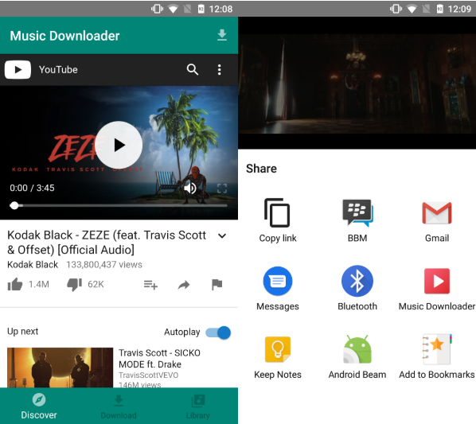

# Music Downloader
This project is motivated by the amount of time I spent on Youtube searching for music. I want a one click mechanism to save music on my phone and for offline uses.

## Getting Started
### Installation
1. Clone the project
2. Open in Android Studio
3. Build and Run the project on your device

### Usage
1. You can either download music directly from the app using the download icon in the app bar 
2. Share Youtube link to app
Once download is finished, the song should appear in the 'Library' tab
